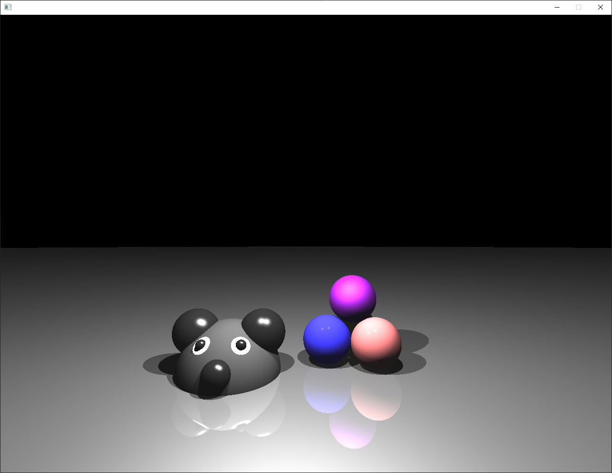
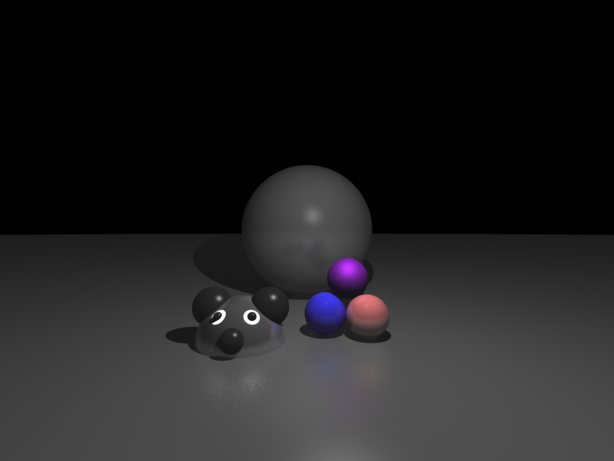

# FoCG_3_Ray_Tracer
Fundamentals of Computer Graphics第三章的简陋光追demo. C++实现.



doc里面有动图，但那张图没有镜面

话说粗糙的东西表面却像镜子一样看起来就很离谱，于是在反射光上加上了朴素的二维高斯分布



更离谱了……

那就来个8倍超采样，然后啪的一下（下面那张图参数换了）

我的10875h第一次跑到了100%

而且几分钟也不见停，本着人道主义原则我把它关了

在把光追迭代次数除以10后他终于能在1分钟内跑完了

但是效果也没好到哪儿去


下次应该先卷个积什么的……太麻烦了

大概可以用脚本建立场景了，但是我只做了球面

像这样子就可以生成下面的图

材质的定义的话一定要放到表面定义的前面，因为这个解释器太懒了记不住表面定义

```
#	Camera
#	c	ex	ey	ez	vx	vy	vz	ux	uy	uz
	c	0	0	4	0	1	0	1	0	0
#	t	name	[Km...]		[Ka...]		[Ks...]		[Kd...]
#	t	name	Kmr	Kmg	Kmb	Kar	Kag	Kab	Ksr	Ksg	Ksb	Kdr	Kdg	Kdb	p
	t	bg		0.2	0.2	0.2	0.5	0.5	0.5	3	3	3	3	3	3	10
	t	bred	0	0	0	1	0.5	0.5	10	5	5	10	5	5	2000
	t	bgreen	0	0	0	1	1	0.5	7	7	5	4	10	5	400
	t	bblue	0	0	0	0.3	0	2	3	2	10	2	2	10	1000
	t	bpurple		0	0	0	0.3	0	1	6	2	8	6	1	8	10
	t	bhead	0	0	0	0.3	0.3	0.3	10	10	10	3	3	3	10000
	t	bbdpart	0	0	0	0.3	0.3	0.3	10	10	10	1	1	1	100
	t	eyew	0	0	0	0.3	0.3	0.3	3	3	3	70	70	70	10

#	s	s	posx		posy		posz		radius	texture
	s	s	0			-100000		0			99995	bg
	s	s	2.816497	-4			-10.3382	1		bred
	s	s	2.298858	-4			-12.27006	1		bgreen
	s	s	0.884645	-4			-10.855841	1		bblue
	s	s	2			-2.36		-11.1547	1		bpurple
	s	s	-3			-5			-10			2		bhead
	s	s	-4.28558	-3.4679		-10			0.9		bbdpart		#ears
	s	s	-1.71442	-3.4679		-10			0.9		bbdpart
	s	s	-3			-4.4		-8.2		0.5		bbdpart		#nose
	s	s	-3.70711	-3.58578	-8.77526	0.19	bbdpart		#leyeb
	s	s	-2.29289	-3.58578	-8.77526	0.19	bbdpart		#reyeb
	s	s	-3.35356	-4.29289	-9.38762	1.03	eyew		#leyew
	s	s	-2.64644	-4.29289	-9.38762	1.03	eyew		#reyew
	
#	l	posx		posy		posz	lumr	lumg	lumb
	l	2			5			-6		0.9		0.9		0.9
	l	-2			2.5			-7		0.9		0.9		0.9
```


